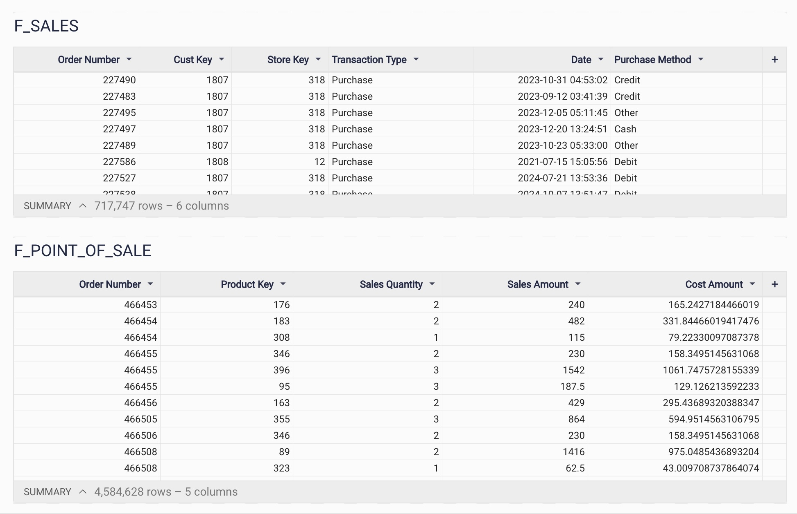

# Project 1: Dashboard Analysis

## File: plugs1.jpg

This file is a screenshot of a Sigma Computing BI dashboard showing two key tables:

### 1. F_SALES
- **Columns**:
  - Order Number
  - Customer Key
  - Store Key
  - Transaction Type (e.g., Purchase)
  - Date
  - Purchase Method (e.g., Credit, Cash)
- **Purpose**: 
  This table tracks transactional data to analyze purchase trends across stores and methods.

### 2. F_POINT_OF_SALE
- **Columns**:
  - Order Number
  - Product Key
  - Sales Quantity
  - Sales Amount
  - Cost Amount
- **Purpose**: 
  This table provides detailed product-level sales insights, helping identify top-performing items and their profitability.

### Use Case:
This dashboard is designed to:
- Provide business stakeholders with transactional and sales insights.
- Highlight trends in purchase behavior and product sales for decision-making.

---

